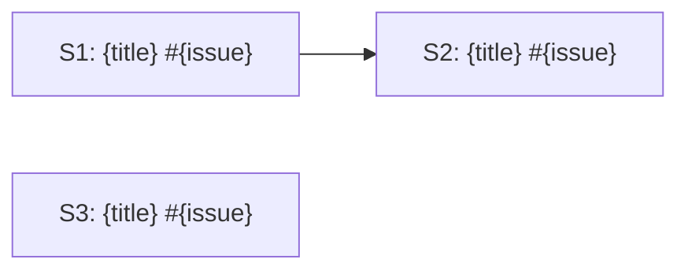
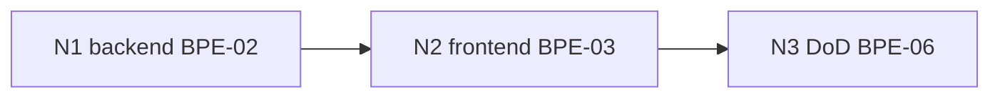

# Activity: Load Context & Sequence

**Activity ID**: 179
**Order**: 2
**Phase**: None
**Dependencies**: Predecessor: Activity 178 (Activate Iteration)
Successor: Activity 181 (Build)

## Description

Restore the distilled context that PIN already built, then derive and present the full execution queue. This is pure pre-flight — no implementation, no GitHub mutations. Do NOT re-read SAO.md, BDD specs, or mockups from scratch; PIN-02 and PIN-03 already did that work.

## Guidance

## Part A — Load Context

### Step 1: Load Orient Summary (from PIN-02)

```bash
ls -t docs/plans/iterations/pin-orient-*.md 2>/dev/null | head -1
```

**If no file found (first iteration of this feature):**
Apply first-iteration defaults: `velocity_trend: unknown`, `scope_risks: none`, `watch_fors: none`. Continue to Step 2 — do not stop.

**If file found:** read it in full. Extract: velocity trend, scope risks, watch-fors from prior drift.

### Step 2: Load Execution Manifest (from PIN-03)

```bash
ls -t docs/plans/iterations/ITER-*.yaml 2>/dev/null | head -1
```

If no file found: **STOP.** Return to PIN.

Load the most recent manifest for this milestone. Extract per scenario:
- `id`, `title`, `github_issue`, `parallel_group`
- `codebase_footprint[]`
- `context_map[]` (file + lines + note)
- `do_not_do[]`
- `checkpoint.command` and `checkpoint.log_story_command`
- `feature_execution_graph` — `nodes[]` with `id`, `bpe`, `depends_on`, `footprint[]`, `gate`
- `dependencies[]` — other GitHub issues that must be closed first
- `feature_file_paths[]` — paths to `.feature` files for this scenario
- `system_dependencies[]` — infrastructure capabilities required

### Step 3: Spot-Check Context Map References

For each scenario, verify 1–3 `context_map` entries still exist:

```bash
wc -l {file}   # confirm file exists and has sufficient lines
```

If a file is missing or significantly shorter than expected: flag as potential `sao_violation` before executing that scenario.

### Step 4: Check System Dependencies

For each declared `system_dependencies[]` item, verify it exists in the codebase:
- `notification_service` → `methodology/services/notification_service.py` or equivalent
- `email_backend` → Django email settings configured
- `task_queue` → Celery or equivalent present
- `search_backend` → search index setup confirmed

If any declared dependency is absent:
> **STOP before any implementation.** Post escalation on the first affected issue (see MIN-03 drift protocol) and await human decision.

## Part B — Sequence

### Step 5: Parse Parallel Groups and Conflict Map

From the loaded manifest:
- Extract `parallel_groups`: e.g. `A: [S1, S3]`, `B: [S2]`
- Extract `conflict_map`: e.g. `mcp_integration/tools.py: [S1, S2]`

> The conflict map was derived by PIN-02 from actual `git diff --name-only` per skeleton commit. Do not recompute it.

### Step 6: Check Dependency State Per Scenario

For each scenario, check `dependencies[]`. Fetch each one at a time:

```bash
gh issue view {dependency_issue_number} --json number,state,labels
```

Mark each scenario as:
- **READY** — no dependencies, or all dependency issues closed with `status-done`
- **BLOCKED** — one or more dependency issues still open

### Step 7: Build Ordered Execution Queue

Order: Group A → Group B → Group C. Within each group, READY before BLOCKED.

### Step 8: Output Execution Plan (Plan Mode)

Switch to **Plan Mode**. Present two-level diagrams:

**Outer** — scenario dependency graph:



**Inner** — for each READY scenario, `feature_execution_graph` node dependencies:



Then output the execution plan:

```
=== CONTEXT LOADED ===
Orient:   {filename or "first iteration — no history"}
          velocity_trend: {value or "unknown"}
          watch_fors: {list or "none"}
Manifest: ITER-{slug}.yaml — {N} scenarios
System deps: {list or "none — all clear"}
Spot-check: {N}/{N} context_map refs confirmed

=== EXECUTION QUEUE ===
Groups: {N} | Scenarios: {N} ready, {N} blocked

Group A (parallel):
  [READY] S1 #{issue} — {title} — nodes: N1→N2→N3
  [READY] S3 #{issue} — {title} — nodes: N1→N2

Group B (after A completes):
  [BLOCKED] S2 #{issue} — {title} — waiting for #{dep_issue}

First ready nodes to dispatch:
  S1/N1 [BPE-02]
  S3/N1 [BPE-02]  (parallel — conflict_map allows)

Conflicts: {file} shared by {S1, S2} — serialized across groups
Next: MIN-03 Build
=======================
```

## Success Criteria

- Orient summary loaded or first-iteration defaults applied
- Execution manifest loaded (hard stop if missing)
- System dependencies verified against codebase before any execution
- `feature_file_paths[]`, `feature_execution_graph`, and `do_not_do[]` extracted per scenario
- Context map spot-check complete; `sao_violation` flagged if any reference missing
- Parallel groups and conflict map parsed from manifest (not recomputed)
- Each scenario dependency state checked via `gh issue view` (one at a time)
- Mermaid diagrams presented; execution queue ordered; first ready nodes identified
- Ready to proceed to MIN-03

## Inputs

- **Orient Summary** (`docs/plans/iterations/pin-orient-{date}.md`) — produced by PIN-02 (optional; missing on first iteration is normal)
- **Execution Manifest** (`docs/plans/iterations/ITER-*.yaml`) — produced by PIN-03 (required)

## Agent

None — Team Lead (TL) runs this activity inline.

## Skill

None

## Rules

None

## Artifacts Produced

None

## Artifacts Consumed

None

## Notes

No additional notes.
