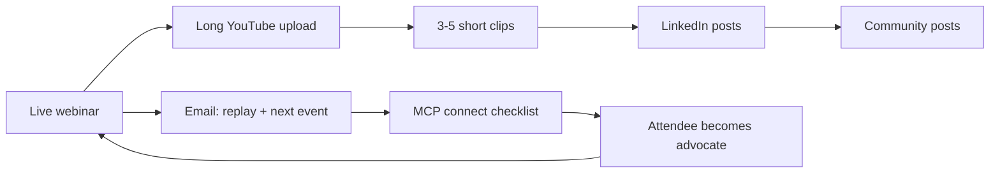

# Evangelization Strategy

## Goal

Take Mimir to the community and grow followers by proving value to distinct user classes — the same roles described on **What Mimir Can Do** — through live code-alongs and repurposed video.

## Two channels

### 1. Webinars (live, 30 minutes)

**Format:** Code-along events. Host shares screen in Cursor; attendees follow along (with pre-work done async).

**Audience:** One persona / one job-to-be-done per session. Examples:

| Persona | Example webinar title |
|---------|----------------------|
| Product Owner | "I'm a PO. I want to build a POC using Edda. How do I?" |
| Team Lead / Lead Engineer | "I have a TDD playbook. I want everyone on the program to use it. How do I?" |
| Release Engineer | "I want to share infra blueprints (compute, storage, networking) with the department. How do I?" |
| Competency Center Head | "Turn our domain methodology into a released v1.0 standard teams can't drift from." |
| Scrum Master | "Generate sprint-ready issues from BPE before kickoff." |
| Junior Engineer | "Walk me through BPE-02 before I write a line of code." |

**Pricing**

| Wave | Public seats | Rationale |
|------|--------------|-----------|
| Wave 1 (first 4–6 events) | Free or pay-what-you-want | Build list, channel subs, social proof |
| Wave 2+ | **$5 entrance fee** | Filter tire-kickers; improve live attendance and Q&A quality |
| Always | Direct invites free | Seed room with practitioners who will ask good questions |

Replay on YouTube **7–14 days** after live — discovery without punishing latecomers.

**Why $5 works (with caveats)**

- Creates micro-commitment → higher show-up rate than free-only lists.
- Early community building may need Wave 1 free before introducing fee.
- Fee is secondary to **post-event conversion**: did they register and connect MCP?

### 2. Video (async, repurposed + native)

**Channel:** *FeatureFactory — building in the open*

**Two lengths**

| Type | Length | Source | Primary use |
|------|--------|--------|-------------|
| Comprehensive | 25–35 min | Edited webinar recording | YouTube library, SEO, trust |
| Short | 60–90 sec | Cut from webinar or recorded natively | LinkedIn, communities, hooks to long form |

**Short-video examples**

- "See bugs fixed properly" — demo following `@.cursor/playbooks/Edda/BPE/BPE-09-Fix_Bug.md`
- "Export BPE to Cursor in one command"
- "Release a playbook at v1.0 — changes now require a PIP"

**Distribution**

1. **YouTube** — long form + Shorts
2. **LinkedIn** — short clips with link to full video or next webinar
3. **Thematic communities** — post the *short* clip; link to long video (lower friction than webinar signup)

## Conversion funnel

Every webinar and video ends with the same path:

```text
Register on Mimir FOB
  → Connect MCP (Docker or local — see DOCKER_QUICK_START)
    → Run ONE command from What Mimir Can Do (copy-paste from use-cases page)
      → Join newsletter / LinkedIn / Discord / next webinar
```

Measure success on **MCP connected + first command run**, not registrations alone.

## Persona alignment

**Shipped today** (`use_cases.html`): Lead Engineer, Scrum Master, Competency Center Head, Junior Engineer.

**Expansion personas** (webinar ideas; add use-case sections before promoting):

- Product Owner → map to sprint planning / POC with Edda playbook
- Release Engineer → map to CC Head "share methodology" + workflow export/import
- Project Manager → see `target_user_classes.md` (Huginn / SitRep — future webinars)

Do not run paid ads for a persona until its use-case card exists on the landing page.

## Content flywheel



## Risks and mitigations

| Risk | Mitigation |
|------|------------|
| 30 min too short for setup | Pre-work email; live session = one outcome only; optional +15 min office hours |
| Persona / landing page mismatch | Add use-case section before webinar promotion |
| Low show-up on paid events | Wave 1 free; reminder emails; direct free invites |
| Content ops overload | Fixed repurposing checklist (see [content-pipeline.md](./content-pipeline.md)) |
| Audience doesn't know "Edda" | Always subtitle: "Edda = FeatureFactory playbook on Mimir" |

## What we are not doing (yet)

- Generic "what is Mimir" webinars without a completed outcome
- Slide-only presentations
- Promoting PM/SitRep webinars before Huginn + Manage Project workflow story is ready
- Gating replays permanently behind paywall
