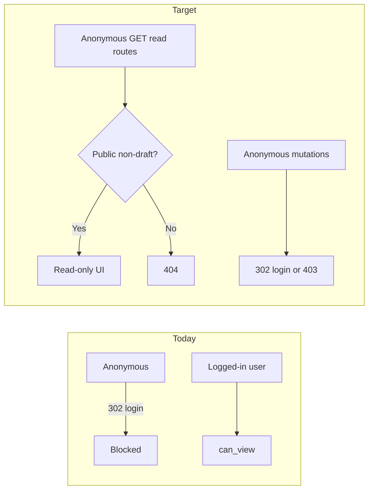

# Anonymous Public Playbook Browse — BPE-08 Change Plan

## Change summary

**Goal:** Prospective users can evaluate Mimir playbooks **without registering**, by browsing playbooks where `visibility=public` and `status=released`, including nested read-only content and **global entity lists** (`/workflows/`, `/activities/`, `/artifacts/`, `/skills/`, `/agents/`, `/rules/`, `/phases/`) filtered to entities belonging to those guest-readable playbooks.

**Confirmed scope (your answers):**
- **In scope:** `visibility=public` + non-draft playbooks only (same rule as today’s cross-user read, minus login)
- **Discovery:** Updated landing page (`/`) with **Explore public playbooks** CTA → `/playbooks/`
- **Out of scope:** Anonymous team browse (`/teams/`), team-private playbooks, MCP anonymous access, any write/create/edit/delete

**Current state:** Model layer already allows anonymous read via [`Playbook.can_view()`](methodology/models/playbook.py) for public non-draft playbooks, but every UI/API route is gated by `@login_required` / `IsAuthenticated` before that logic runs ([`playbooks-access-control.md`](docs/features/act-2-playbooks/playbooks-access-control.md), [`SAO.md` § FOB Authorization](docs/architecture/SAO.md)).

---

## PRD assessment

**There is no standalone PRD file in this repo.** Product requirements live in:

| Artifact | Role | Update needed? |
|----------|------|----------------|
| [`docs/features/act-2-playbooks/playbooks-access-control.md`](docs/features/act-2-playbooks/playbooks-access-control.md) | **Primary permission spec** | **Yes — major** |
| [`docs/features/user_journey.md`](docs/features/user_journey.md) | Narrative / screen flows | **Yes** |
| [`docs/features/act-*/*.feature`](docs/features/) | BDD acceptance criteria | **Yes — 18 files updated, 1 new, 56 unchanged** (see [Per-file feature spec updates](#per-file-feature-spec-updates)) |
| [`docs/ux/IA_guidelines.md`](docs/ux/IA_guidelines.md) | Landing + nav rules | **Yes** |
| [`docs/ux/2_dialogue-maps/screen-flow.drawio`](docs/ux/2_dialogue-maps/screen-flow.drawio) | MVP screen-flow diagram | **Yes — MVP Flow tab** |
| [`docs/architecture/SAO.md`](docs/architecture/SAO.md) | Architecture + auth contract | **Yes** |

No separate PRD document to create unless you want one; updating `playbooks-access-control.md` as the permission source of truth is sufficient.

---

## Documentation updates (Step 1 — before code)

### 1. [`playbooks-access-control.md`](docs/features/act-2-playbooks/playbooks-access-control.md) — source of truth

Update the visibility and access tables:

| Value | Who can view (new) |
|-------|-------------------|
| **Public** | Owner always; **anonymous guests** when `status=released`; **authenticated users** when status ≠ draft |
| **Private** | Owner only (unchanged) |

Update **Access by surface** — add **Anonymous guest** column:

| Surface | Public released (anonymous guest) |
|---------|-----------------------------------|
| FOB GUI list `/playbooks/` | Released public playbooks only (no owned section) |
| FOB GUI detail + child VIEW pages | Read-only; no Edit/Delete/Create/Release/PIP actions |
| Content Browser `/browser/<pk>/` | Allowed when playbook is released + public |
| Graph API `GET /api/playbooks/<pk>/graph/` | Same rule (required for browser) |
| Global lists (`/workflows/`, `/activities/`, `/artifacts/`, `/skills/`, `/agents/`, `/rules/`, `/phases/`) | **Guest read:** rows from released public playbooks only; no Create; private playbook entities absent |
| MCP / REST write | Unchanged — auth required |
| PIPs | **Defer:** keep login-required unless you want anonymous PIP list on public playbooks (not needed for “evaluate content”) |

Move **“Anonymous / non-owner → No”** in PIP table to reflect new guest read for playbook content only.

**Status alignment note:** Guest-readable filter is **`status=released`** (stricter than authenticated `status≠draft`). Fix [`get_accessible_playbook_ids()`](methodology/services/playbook_service.py) for authenticated users to use `status≠draft`; add separate `get_guest_readable_playbook_ids()` for anonymous querysets.

### 2. [`user_journey.md`](docs/features/user_journey.md)

Add a **pre-auth evaluation path** (before Act 1 / registration):

- **Landing (`/`)**: New secondary CTA **Explore public playbooks** → `/playbooks/`
- **Anonymous playbooks list**: Card grid of public non-draft playbooks only; banner: *Sign in to create your own playbooks*
- **Anonymous playbook drill-down**: Same VIEW screens as authenticated public viewers, minus owner actions
- **Fix stale text** at lines ~111–120 that still says “owner-only access in FOB/MCP” and “team assignment planned” — align with current public visibility behavior + new anonymous read

Update **Act 2 LIST+FIND** section (~377–389) and **Content Browser** access note (~2856) from “any authenticated user” → “any user (including anonymous guests)”.

### 3. Feature files — per-file updates

See [Per-file feature spec updates](#per-file-feature-spec-updates) below for every file’s concrete edits.

**Summary:** 20 BDD feature files updated · 2 new BDD files (`playbooks-guest-browse.feature`, `guest-global-entity-lists.feature`) · 1 UAT replay file · 49 feature files unchanged.

### 4. [`IA_guidelines.md`](docs/ux/IA_guidelines.md)

Update § Anonymous landing (~298):

- Keep: no full app nav for anonymous
- Add: **Explore public playbooks** hero CTA on `/`
- Add: minimal guest header on `/playbooks/` and public playbook pages: brand + Sign In + Register (no Dashboard/PIPs/etc.)

### 4b. [`screen-flow.drawio`](docs/ux/2_dialogue-maps/screen-flow.drawio)

**Yes — updates recommended.** The diagram currently models only the **authenticated** happy path and omits public marketing pages entirely.

**Current gaps (MVP Flow - Local FOB tab):**
- Entry is `START → Pull Container → USER-CREATE → … → DASHBOARD → [Playbooks] → LIST+FIND` — no `/` landing, no `/use-cases/`, no anonymous branch
- `FOB-PLAYBOOKS-LIST+FIND` is reachable only from Dashboard (auth required)
- `CREATE / EDIT / DELETE` extend from LIST with no login gate shown
- **Act 16 Content Browser** was never added ([`ACT_16_CONTENT_BROWSER_REMEDIATION.md`](docs/plans/ACT_16_CONTENT_BROWSER_REMEDIATION.md) marked screen-flow **N/A**)

**Required diagram changes (MVP Flow tab):**

| Element | Action |
|---------|--------|
| **New node** `FOB-LANDING-1` (`/`) | Public landing; links to Register, Login, Use Cases, **Explore public playbooks** |
| **New node** `FOB-USE-CASES-1` (`/use-cases/`) | Optional — dashed edge from Landing (page already exists, not on diagram today) |
| **New node** `FOB-PLAYBOOKS-GUEST-LIST` | Guest variant of LIST+FIND — public cards only; annotate “no auth” |
| **New edges** | Landing → `[Explore public playbooks]` → GUEST-LIST → `[Select]` → existing `FOB-PLAYBOOKS-VIEW_PLAYBOOK` |
| **Guest read-only fork** | From VIEW: `[Select]` → child VIEW screens (reuse existing Act 3–8 VIEW nodes); **do not** show `[Edit]` / `[Delete]` / `[Create]` edges for guest path — annotate “→ Login” instead |
| **Auth path preserved** | Landing → Login → Dashboard → LIST+FIND (existing flow unchanged) |
| **New node** `FOB-CONTENT-BROWSER-ACCESS` (`/browser/<pk>/`) | Extend from VIEW `[Content Browser]`; guest-readable when public |
| **Legend / summary box** | Add line: “Guest browse: public non-draft playbooks, read-only, no MCP” |
| **Stroke style** | Guest nodes/edges: dashed orange or note badge `@guest_access` (distinct from green ✅ completed FOB screens) |

**Domain Model tab (optional, low priority):**
- Add sticky note: **Playbook visibility** — Public + non-draft readable by anonymous guests (separate from Team Public/Hidden in `dm-note-visibility`)

**README tab:**
- Update `screenflow-content` bullet list to mention guest pre-auth browse path

**Export:**
- Re-export [`screen-flow-mvp-fob.png`](docs/ux/2_dialogue-maps/screen-flow-mvp-fob.png) after draw.io edits (per [`UX_WORKFLOW.md`](docs/plans/UX_WORKFLOW.md))

**Out of scope for diagram:**
- MCP guest access (unchanged — auth required)
- Team browse for anonymous users
- Anonymous global search

### 5. [`SAO.md`](docs/architecture/SAO.md)

Update **FOB → Authorization** (~2789–2793):

- Replace blanket “All web views require `@login_required`” with **tiered access**:
  - **Public routes:** `/`, `/use-cases/`, legal, auth
  - **Guest read routes:** playbook browse + read-only entity VIEW + content browser + graph API GET — gated by `Playbook.can_view(AnonymousUser)` not login
  - **Authenticated-only:** dashboard, create/edit/delete, teams, PIPs, profile, global search, feedback
  - **Guest read routes:** playbook browse, child VIEW pages, content browser, graph API GET, **global entity lists** (filtered)

Add short **Guest read security** subsection:
- 404 (not 403) for inaccessible playbooks — no existence leak
- Read-only serializers; no API token/profile data
- CSRF/session unchanged for GET; writes still require auth

MCP section: explicitly **no change** — remains token-authenticated.

---

## Per-file feature spec updates

Convention for all edits below:
- **Bob** = anonymous guest (not logged in)
- **Mike** = owner of public **released** playbook `"React Frontend Development"`
- **Guest-readable playbook** = `visibility=public` AND `status=released` (excludes draft, active, disabled)
- **Authenticated public read** = `visibility=public` AND `status≠draft` (unchanged for logged-in users)
- **404 not 403** for private/inaccessible playbooks (no existence leak)
- **Guest banner** on guest pages: *Sign in to create and edit playbooks* with `[Sign In]` / `[Register]` (`data-testid="guest-auth-banner"`)

---

### Act 2 — Playbooks (7 files)

#### [`playbooks-access-control.md`](docs/features/act-2-playbooks/playbooks-access-control.md) — **rewrite permission tables**

| Section | Specific change |
|---------|-----------------|
| Visibility table (L15–18) | Public row: guests when `status=released`; authenticated when status ≠ draft |
| Access by surface (L27–34) | Add **Anonymous guest** column; fill per plan §1; REST API row: add “GET read on public playbook resources: AllowAny + can_view” |
| PIP table (L46–53) | Split row: “Anonymous guest” → No for PIP submit/finalize; add footnote that playbook **content** read is allowed |
| Deferred (L61–66) | Remove “GUI-only public read” phrasing; keep “MCP public read access” as deferred |
| Related specs (L70–78) | Add `playbooks-guest-browse.feature` |

#### [`playbooks-guest-browse.feature`](docs/features/act-2-playbooks/playbooks-guest-browse.feature) — **NEW**

End-to-end guest journey (single file, `@guest_access` tag):

| Scenario ID | Steps |
|-------------|-------|
| `FOB-PLAYBOOKS-GUEST-01` | Bob on `/` sees `[Explore public playbooks]` (`data-testid="landing-cta-explore-playbooks"`) → `/playbooks/` |
| `FOB-PLAYBOOKS-GUEST-02` | Bob on `/playbooks/` sees public cards with “by {username}”; no owned section; guest banner visible; no `[Create New Playbook]` (or it links to login) |
| `FOB-PLAYBOOKS-GUEST-03` | Bob opens public playbook detail → read-only tabs; no Edit/Delete/Release/Submit PIP/Export JSON |
| `FOB-PLAYBOOKS-GUEST-04` | Bob GET private playbook detail → HTTP 404 |
| `FOB-PLAYBOOKS-GUEST-05` | Bob drills Workflow → Activity → Artifact in public playbook; each page read-only, no mutation buttons |
| `FOB-PLAYBOOKS-GUEST-06` | Bob opens Content Browser from playbook header → graph loads |
| `FOB-PLAYBOOKS-GUEST-07` | Bob GET `/playbooks/create/` → redirect to login with `?next=` |
| `FOB-PLAYBOOKS-GUEST-08` | Bob GET `/dashboard/` → redirect to login (unchanged guard) |

#### [`guest-global-entity-lists.feature`](docs/features/act-2-playbooks/guest-global-entity-lists.feature) — **NEW**

Cross-cutting guest global list routes (`@guest_access @global_lists`):

| Scenario ID | Route | Assertions |
|-------------|-------|------------|
| `FOB-GUEST-GLOBAL-01` | `/workflows/` | Bob sees workflows from Mike’s **released** public playbook; no Create; no rows from private or draft/active/disabled public playbooks |
| `FOB-GUEST-GLOBAL-02` | `/activities/` | Same filter |
| `FOB-GUEST-GLOBAL-03` | `/artifacts/` | Same filter |
| `FOB-GUEST-GLOBAL-04` | `/skills/` | Same filter |
| `FOB-GUEST-GLOBAL-05` | `/agents/` | Same filter |
| `FOB-GUEST-GLOBAL-06` | `/rules/` | Same filter |
| `FOB-GUEST-GLOBAL-07` | `/phases/` | Same filter |

#### [`playbooks-list-find.feature`](docs/features/act-2-playbooks/playbooks-list-find.feature)

| Location | Change |
|----------|--------|
| Header comment (L6–8) | “authenticated users” → “any user (including anonymous guests)” for public browse |
| **Add** `FOB-PLAYBOOKS-LIST+FIND-26` | Bob opens `/playbooks/` → sees Mike’s public released playbook; no Edit/Delete on card; guest banner |
| **Add** `FOB-PLAYBOOKS-LIST+FIND-27` | Bob opens `/playbooks/` when zero public playbooks → empty state *Explore public playbooks will appear here* (not owner empty state) |
| **Add** `FOB-PLAYBOOKS-LIST+FIND-28` | Bob GET `/playbooks/` → `[Create New Playbook]` absent or redirects to login |
| Scenario 19c (L186) | No change (draft public still hidden from everyone except owner) |
| Scenario 25 (L241–247) | Update comment: “authenticated” → “logged-in non-owner”; behavior unchanged |

#### [`playbooks-view.feature`](docs/features/act-2-playbooks/playbooks-view.feature)

| Location | Change |
|----------|--------|
| Header comment (L6–8) | “any authenticated user” → “any user (including anonymous guests)” |
| Scenario 04b (L64–73) | Rename actor note: applies to **Maria (logged in)** and **Bob (guest)** — add parallel scenario `FOB-PLAYBOOKS-VIEW_PLAYBOOK-04d` for Bob with same Then steps minus PIP viewing note |
| **Add** `FOB-PLAYBOOKS-VIEW_PLAYBOOK-04e` | Bob GET private playbook `/playbooks/<pk>/` → 404 |
| Scenario 07 (L104–113) | Add Then branch: when Bob views public playbook Workflows tab → `[Add Workflow]` not visible |
| Scenario 18 area (L191–202) | Clarify Export JSON owner-only; Bob does not see Export |
| All other scenarios | No change (Background stays Maria authenticated) |

#### [`playbooks-create.feature`](docs/features/act-2-playbooks/playbooks-create.feature)

| Location | Change |
|----------|--------|
| Header comment (L7–12) | L7: “any authenticated user” → “anyone (including anonymous guests)”; L12: “GUI-only public read” → remove (MCP still author-scoped) |
| Scenario 07b (L92–99) | Help text: “Any authenticated user can view…” → “Anyone can view this playbook (no sign-in required once released); only you can edit or delete it” |
| L98 | “any authenticated user” → “anyone” |
| **Add** `FOB-PLAYBOOKS-CREATE_PLAYBOOK-22` | Bob GET `/playbooks/create/` → 302 login |
| **Add** `FOB-PLAYBOOKS-CREATE_PLAYBOOK-23` | Bob POST to create wizard → 302 login |

#### [`playbooks-edit.feature`](docs/features/act-2-playbooks/playbooks-edit.feature)

| Location | Change |
|----------|--------|
| Header comment (L7) | “any authenticated user” → “anyone (including anonymous guests)” |
| Scenario 08a help text (L88) | “any authenticated user can view” → “anyone can view (no sign-in required for non-draft)” |
| Scenarios 08b–08c (L91–104) | L96/L104: “authenticated user” / “non-owners” → “anyone” / “guests and non-owners” |
| **Add** `FOB-PLAYBOOKS-EDIT_PLAYBOOK-26` | Bob GET edit URL for public playbook → 302 login |
| **Add** `FOB-PLAYBOOKS-EDIT_PLAYBOOK-27` | Bob GET edit URL for private playbook → 302 login (never reaches 404 on edit route) |

#### [`playbooks-delete.feature`](docs/features/act-2-playbooks/playbooks-delete.feature)

| Location | Change |
|----------|--------|
| Comment L98 | “all authenticated users” → “anyone who could view it (including anonymous guests)” |
| Scenario 12 warning text (L102) | “all other users who can currently view it” → “all viewers including anonymous guests” |
| **Add** `FOB-PLAYBOOKS-DELETE_PLAYBOOK-15` | Bob GET delete URL or POST delete → 302 login |

#### [`playbooks-versioning.feature`](docs/features/act-2-playbooks/playbooks-versioning.feature)

| Change | Detail |
|--------|--------|
| **No scenario changes** | Versioning is owner/MCP-only |
| **Add comment** at top | “Guest read of released public playbooks: History tab read-only per playbooks-view.feature; guest cannot access edit URLs (VERSIONING-09)” |

---

### Act 3 — Workflows (1 file updated, 6 unchanged)

#### [`workflows-view.feature`](docs/features/act-3-workflows/workflows-view.feature) — **UPDATE**

| **Add** scenario | Content |
|------------------|---------|
| `FOB-WORKFLOWS-VIEW_WORKFLOW-11` | Given Bob not logged in; Mike owns public released playbook with workflow “Component Development”; When Bob GET workflow detail URL; Then name, description, activities list visible; And no `[Edit Workflow]`, `[Delete Workflow]`, `[Add Activity]` |
| `FOB-WORKFLOWS-VIEW_WORKFLOW-12` | Bob GET workflow in private playbook → 404 |

**Unchanged:** `workflows-list-find.feature` (playbook-scoped scenarios), create, edit, delete, export-import, rules-crudlf. **Also update:** `guest-global-entity-lists.feature` (GUEST-GLOBAL-01 for `/workflows/`).

---

### Act 4 — Phases (1 file updated, 4 unchanged)

#### [`phases-view.feature`](docs/features/act-4-phases/phases-view.feature) — **UPDATE**

| **Add** scenario | Content |
|------------------|---------|
| `FOB-PHASES-VIEW_PHASE-06` | Bob GET phase VIEW in public playbook → phase name, description, order visible; no Edit/Delete |
| `FOB-PHASES-VIEW_PHASE-07` | Bob GET phase in private playbook → 404 |

**Unchanged:** `phases-list-find.feature`, `phases-create.feature`, `phases-edit.feature`, `phases-delete.feature`

---

### Act 5 — Activities (1 file updated, 4 unchanged)

#### [`activities-view.feature`](docs/features/act-5-activities/activities-view.feature) — **UPDATE**

| **Add** scenario | Content |
|------------------|---------|
| `FOB-ACTIVITIES-VIEW_ACTIVITY-10` | Bob GET activity VIEW in public playbook → guidance markdown, dependencies, input/output artifacts visible; no `[Edit Activity]`, `[Delete Activity]`, no “Change Agent/Skill” buttons |
| `FOB-ACTIVITIES-VIEW_ACTIVITY-11` | Bob GET activity in private playbook → 404 |
| **Add** `FOB-ACTIVITIES-VIEW_ACTIVITY-12` | Bob GET activity embed URL `?embed=1` in public playbook → embed HTML without navbar; no login redirect |

**Unchanged:** create, edit, delete, list-find

---

### Act 6 — Artifacts (1 file updated, 5 unchanged)

#### [`artifacts-view.feature`](docs/features/act-6-artifacts/artifacts-view.feature) — **UPDATE**

| **Add** scenario | Content |
|------------------|---------|
| `FOB-ARTIFACTS-VIEW_ARTIFACT-08` | Bob GET artifact VIEW linked to public playbook activity → name, type, template info read-only; no Edit/Delete |
| `FOB-ARTIFACTS-VIEW_ARTIFACT-09` | Bob GET artifact in private playbook → 404 |
| `FOB-ARTIFACTS-VIEW_ARTIFACT-10` | Bob GET `/artifacts/<pk>/?embed=1` for public playbook artifact → embed content loads |

**Unchanged:** list-find, create, edit, delete, flow (all mutation-heavy)

---

### Act 7 — Agents (1 file updated, 5 unchanged)

#### [`agents-view.feature`](docs/features/act-7-agents/agents-view.feature) — **UPDATE**

| **Add** scenario | Content |
|------------------|---------|
| `AGENT-VIEW-07` | Bob GET agent VIEW in public playbook → name, description, linked activities read-only; no Edit/Delete |
| `AGENT-VIEW-08` | Bob GET agent in private playbook → 404 |
| `AGENT-VIEW-09` | Bob GET `/agents/<pk>/?embed=1` → embed loads for public playbook agent |

**Unchanged:** `agents-list-find.feature`, create, edit, delete. **Also update:** `agents-global-list.feature` (AGENT-GLOBAL-13..15) + `guest-global-entity-lists.feature` (GUEST-GLOBAL-05).

---

### Act 8 — Skills (1 file updated, 5 unchanged)

#### [`skills-view.feature`](docs/features/act-8-skills/skills-view.feature) — **UPDATE**

| **Add** scenario | Content |
|------------------|---------|
| `FOB-SKILLS-VIEW_SKILL-07` | Bob GET skill VIEW in public playbook → title, capability, tech stack, markdown content visible; no Edit/Delete |
| `FOB-SKILLS-VIEW_SKILL-08` | Bob GET skill in private playbook → 404 |
| `FOB-SKILLS-VIEW_SKILL-09` | Bob GET skill embed URL `?embed=1` → embed loads |

**Unchanged:** create, edit, delete, list-find, link

---

### Rules (no dedicated `.feature` file — covered via browser + playbook routes)

Rules have no standalone `rules-view.feature`; access is via playbook-scoped URLs and content browser embeds ([`_implementation_notes.md`](docs/features/act-16-content-browser/_implementation_notes.md) L103).

| Location | Change |
|----------|--------|
| `playbooks-guest-browse.feature` scenario 05 | Extend drill-down to include Rule VIEW at `/playbooks/<pb>/rules/<r>/` and `?embed=1` |
| `workflows-rules-crudlf.feature` | **No scenario changes** — add header comment: “Guest read: rule VIEW + embed only; CRUD requires auth” |

---

### Act 9 — PIPs (0 files updated — comments only)

| File | Action |
|------|--------|
| `pips-view.feature`, `pips-list.feature`, `pips-create.feature`, `pips-admin-review.feature`, others | **No scenario changes** — PIPs stay login-required |
| `pips-view.feature` header (L7) | Add comment: “Anonymous guests cannot access PIP routes; playbook content browse does not include PIP list for guests (deferred)” |
| `pips-admin-review.feature` (L7, L204) | “Public viewers” stays = authenticated non-owner only |

---

### Act 11 — Teams (0 files updated)

All `team-*.feature` files keep existing `Maria is not logged in → redirect login` scenarios. Team browse remains authenticated-only per scope.

---

### Act 13 — MCP (0 files updated)

All `interact-with-*.feature` and `mcp-integration.feature` unchanged — MCP requires `--user` token.

---

### Act 14 — Profile (0 files updated)

`profile-view.feature`, `profile-edit.feature` — login guards unchanged.

---

### Act 16 — Content Browser (4 files updated, 3 unchanged)

#### [`01-access-and-nav.feature`](docs/features/act-16-content-browser/01-access-and-nav.feature) — **UPDATE**

| Scenario | Change |
|----------|--------|
| **Replace** `FOB-CONTENT-BROWSER-01b` (L19–23) | Split into two: **`01b-guest-public`**: Bob GET `/browser/<public_pk>/` → three-panel layout renders, graph loads; **`01b-guest-private`**: Bob GET `/browser/<private_pk>/` → 404 |
| **Add** `FOB-CONTENT-BROWSER-01c` | Bob on browser page sees guest banner; no full app navbar (minimal header per IA) |
| Scenario 03c (L45–50) | Change “visitor” to cover both authenticated non-member and Bob; behavior unchanged (404) |

#### [`02-graph-api.feature`](docs/features/act-16-content-browser/02-graph-api.feature) — **UPDATE**

| **Add** scenario | Content |
|------------------|---------|
| `FOB-CONTENT-BROWSER-13f` | Bob GET `/api/playbooks/<public_pk>/graph/` without token → 200 JSON with nodes/edges |
| `FOB-CONTENT-BROWSER-13g` | Bob GET graph for private playbook → 404 |
| Scenario 13 (L11–15) | Add note: access rules apply to anonymous same as authenticated public viewer |
| Scenario 13c (L86–90) | **Keep** — session expiry redirect still applies to logged-in users only |

#### [`04-detail-panel.feature`](docs/features/act-16-content-browser/04-detail-panel.feature) — **UPDATE**

| **Add** scenario | Content |
|------------------|---------|
| `FOB-CONTENT-BROWSER-08d` | Bob clicks Activity node → panel fetches embed URL → entity content loads without login redirect |
| Scenario 08c (L41–46) | Add comment: applies to authenticated users only; guests don’t have sessions to expire |

#### [`_implementation_notes.md`](docs/features/act-16-content-browser/_implementation_notes.md) — **UPDATE**

| Section | Change |
|---------|--------|
| Embed mode table (L95–104) | Add note: embed URLs on public playbooks work for anonymous GET |
| Session expiry (L144, L180) | Clarify: guest graph/embed fetch must **not** redirect to login on 200; only authenticated session expiry triggers redirect |
| Tests ref (L198) | Add `test_guest_playbook_browse.py` |

**Unchanged:** `03-graph-rendering.feature`, `05-left-panel.feature`, `06-filters-and-search.feature`, `07-canvas-controls.feature` — behavior inherits from access rules; Background stays Maria authenticated.

---

### Act 0 — Auth / Navigation (0 feature files; landing covered in guest-browse)

| File | Action |
|------|--------|
| [`navigation.feature`](docs/features/act-0-auth/navigation.feature) | **No change** — dashboard/nav scenarios require auth |
| [`authentication.feature`](docs/features/act-0-auth/authentication.feature) | **No change** |
| [`onboarding.feature`](docs/features/act-0-auth/onboarding.feature) | **No change** |

Landing CTA scenario lives in `playbooks-guest-browse.feature` (FOB-PLAYBOOKS-GUEST-01).

---

### Manual UAT replay — [`tests/uat/e2e-uat-flow.feature`](tests/uat/e2e-uat-flow.feature) — **UPDATE**

**Yes — this file needs updates.** It already proves **authenticated** public/private isolation (J3B / UAT-03-05, UAT-03-05b) but has **no anonymous guest path**. [`mcp-uat-flow.feature`](tests/uat/mcp-uat-flow.feature) stays unchanged (MCP remains token-auth; MCP-01b covers authenticated cross-user MCP read).

| Area | Change |
|------|--------|
| **Journey map (L19–29)** | Add **J0 — Guest evaluation (pre-registration)** with scenarios UAT-00-01 … UAT-00-07 |
| **Execution order (L7–17)** | Note optional **J0 before J1** (incognito, no cookies) OR **J0 after UAT-03-05 admin-create-public** to reuse `<ADMIN_PUBLIC_PB_ID>` / `<ADMIN_PRIVATE_PB_ID>` |
| **DEVIATIONS (L47–54)** | Row: narrative “browse before register” → J0 guest path on shipped MVP |
| **UAT-03-01 / UAT-03-01b (L181, L196)** | Update `[data-testid="visibility-help"]` SEE: Public = anyone including anonymous when status≠draft (not “authenticated readers only”) |
| **UAT-03-05 (L288–322)** | Add header comment: **authenticated** uat_user path; anonymous equivalent is J0 — do not replace |
| **UAT-03-05b (L324–358)** | No structural change; admin cross-user checks remain auth-only |

#### New Journey 0 scenarios (mirror `playbooks-guest-browse.feature`)

| Scenario | Steps (operator script) |
|----------|---------------------------|
| **UAT-00-01** Landing Explore CTA | Incognito GET `/` → SEE `[data-testid="landing-cta-explore-playbooks"]` → click → `/playbooks/` |
| **UAT-00-02** Guest public list | No login; GET `/playbooks/` → SEE guest banner + `[data-testid="public-playbook-card-<ADMIN_PUBLIC_PB_ID>"]`; no Create button (or Sign in link) |
| **UAT-00-03** Guest public detail read-only | GET `/playbooks/<ADMIN_PUBLIC_PB_ID>/` → detail 200; Edit/Delete/Release absent; workflow link works |
| **UAT-00-04** Guest private 404 | GET `/playbooks/<ADMIN_PRIVATE_PB_ID>/` → HTTP 404 (not login redirect) |
| **UAT-00-05** Guest login gates | GET `/playbooks/create/`, `/dashboard/` → redirect to login |
| **UAT-00-06** Guest content browser (optional) | GET `/browser/<ADMIN_PUBLIC_PB_ID>/` → graph loads; click Activity node → embed panel without login redirect |
| **UAT-00-07** Guest global workflows list | Incognito GET `/workflows/` → sees workflow from `<ADMIN_PUBLIC_PB_ID>`; no Create; private playbook workflows absent |

**Precondition for J0:** admin has created and released a public playbook + a private playbook (reuse UAT-03-05 admin steps, or document one-time admin seed before J0).

**Placeholder registry:** reuse `<ADMIN_PUBLIC_PB_ID>` / `<ADMIN_PRIVATE_PB_ID>` — no new placeholders required unless operator runs J0 before J3B (then add one-time admin seed block at top of J0).

---

### Other docs (non-`.feature` but in scope)

#### [`user_journey.md`](docs/features/user_journey.md)

| Section / lines | Specific edit |
|-----------------|---------------|
| **New § “Act 0.5 — Guest evaluation (pre-registration)”** before Act 1 | Landing CTA → public list → drill-down → sign-up prompt |
| L111–120 (Mike visibility) | Replace stale “owner-only in FOB/MCP” with current Public visibility + anonymous read |
| L377–389 (Act 2 LIST+FIND) | Add anonymous variant: public-only grid, guest banner, no Create |
| L415–419 (Visibility dropdown) | Update help text to mention anonymous browse for Public non-draft |
| L612–613 (Edit form visibility note) | Remove “does not share playbooks with others today” |
| L2856 (Content Browser access) | “any authenticated user” → “any user including anonymous guests” |

#### [`IA_guidelines.md`](docs/ux/IA_guidelines.md)

| Section | Edit |
|---------|------|
| L298 Anonymous landing | Add Explore CTA; define **guest chrome** (brand + Sign In + Register only) on `/playbooks/` and public playbook drill-down |
| L300 Right-side authenticated | Clarify: global search, notifications, user menu hidden for guests |

#### [`SAO.md`](docs/architecture/SAO.md)

| Section | Edit |
|---------|------|
| L2789–2793 FOB Authorization | Replace single login_required rule with tiered route table (public / guest-read / auth-only) |
| **New** Guest read security | 404 policy, AllowAny+can_view on graph GET, no serializer leaks |
| L924–926 Cytoscape/API guidance | Note graph GET allows anonymous for public playbooks |
| MCP sections | Explicit “no change — token required” |

---

### Files explicitly NOT updated (56 `.feature` files)

No edits unless a comment references “authenticated-only public read”:

- **Act 3:** workflows-list-find, create, edit, delete, export-import, rules-crudlf
- **Act 4:** phases-list-find, create, edit, delete
- **Act 5:** activities-list-find, create, edit, delete
- **Act 6:** artifacts-list-find, create, edit, delete, flow
- **Act 7:** agents-list-find, global-list, create, edit, delete
- **Act 8:** skills-list-find, create, edit, delete, link
- **Act 9:** all 5 pips feature files (comments only above)
- **Act 10:** import-export
- **Act 11:** all 4 team feature files
- **Act 12:** sync-scenarios
- **Act 13:** all 8 MCP feature files
- **Act 14:** profile-view, profile-edit
- **Act 15:** error-recovery
- **Act 0:** navigation, authentication, onboarding, email-verification

**Rationale:** Playbook-scoped LIST+FIND routes remain owner/authenticated contexts. **Global** LIST routes open to guests but queryset-filtered to entities whose parent playbook is guest-readable (`released` + `public`).

---

## Implementation plan (Step 3 — after doc approval)

Work in vertical slices; test-first per BPE-08 rules.

### Slice A — Access primitives

1. Add `PlaybookService.list_public_playbooks_for_guest()` — `visibility=public` AND `status=released` only.
2. Add `PlaybookService.get_guest_readable_playbook_ids()` for anonymous queryset filtering.
3. Tighten `Playbook.can_view()` for anonymous users: public + `status=released` only (authenticated users keep `status≠draft`).
4. Align `get_accessible_playbook_ids()` for authenticated users to `status != 'draft'`.
5. Extend [`playbook_access.py`](methodology/utils/playbook_access.py): `playbook_readable_or_404(request, pk)` works for `AnonymousUser`.

### Slice B — Auth decorator

Add `guest_read_or_login_required` (or split views):

- **GET** on allowlisted read routes → proceed; enforce `can_view` in helper
- **POST/PUT/DELETE** or create wizard steps → `@login_required` as today

Allowlist (initial):

- `/playbooks/` (list — guest variant shows released public only)
- `/playbooks/<pk>/` (detail)
- `/playbooks/<pk>/workflows/...`, `/activities/...`, `/artifacts/...`, `/skills/...`, `/rules/...`, `/agents/...`, `/phases/...` — **VIEW actions only**
- `/browser/<pk>/`
- **Global lists:** `/workflows/`, `/activities/`, `/artifacts/`, `/skills/`, `/agents/`, `/rules/`, `/phases/` — GET only; queryset filtered to guest-readable playbooks

### Slice C — Landing + playbooks list UI

- [`templates/methodology/index.html`](templates/methodology/index.html): add `data-testid="landing-cta-explore-playbooks"` button linking to `/playbooks/`
- [`playbook_views.py`](methodology/playbook_views.py) `list_playbooks`: branch for anonymous → public grid only; hide Create or link to login
- Guest banner component in templates: *Sign in to create and edit playbooks*

### Slice D — Read-only child views + content browser

- Replace `@login_required` with guest-aware decorator on **view/detail** handlers in:
  - `workflow_views.py`, `activity_views.py`, `artifact_views.py`, `skill_views.py`, `rule_views.py`, `agent_views.py`, `phase_views.py`, `browser_views.py`
- Templates: hide Edit/Delete/Create/Release/Content Browser owner actions when `not request.user.is_authenticated` (browser itself stays available)

### Slice E — Global entity lists (guest)

- Apply guest decorator + anonymous branch on each `*_list_global` view
- Filter querysets by `get_guest_readable_playbook_ids()`
- Templates: hide Create buttons; show guest banner

### Slice F — REST API for graph

- [`methodology/api/viewsets.py`](methodology/api/viewsets.py) + permissions: `AllowAny` + `can_view` check on **safe methods** for playbook graph endpoint only
- Keep `IsAuthenticated` on all mutations and non-public resources

### Slice G — Tests

| Test file | Coverage |
|-----------|----------|
| New `tests/integration/test_guest_playbook_browse.py` | Landing CTA, anonymous list, detail, private 404, released-only filter |
| New `tests/integration/test_guest_global_lists.py` | Anonymous GET on all 7 global list routes |
| [`test_content_browser_access.py`](tests/integration/test_content_browser_access.py) | Flip 01b expectation |
| [`test_playbook_view.py`](tests/integration/test_playbook_view.py) | Anonymous public read |
| [`test_api_public_playbook_access.py`](tests/integration/test_api_public_playbook_access.py) | Anonymous graph GET |
| Child view integration tests | One test per entity type for guest read |

Run: `.venv/bin/python -m pytest tests/integration/test_guest_playbook_browse.py tests/integration/test_content_browser_access.py -v`

### Explicit non-goals (this change)

- MCP anonymous mode
- Anonymous `/teams/` browse
- Anonymous global search
- Anonymous PIP viewing/submission
- Guest visibility of **active** or **disabled** public playbooks (guests: **released only**)
- Opening team-shared **private** playbooks to non-members

---

## Execution protocol (small increments)

Every todo follows [do-small-increments](.windsurf/rules/do-small-increments.md):

1. **One atomic change** per todo (one file, one method, or one RED→GREEN pair)
2. **Write → run → test → evaluate → fix** before checking the todo done
3. **No batching** unrelated files in one commit (`commit-impl-slices` enforces per-slice commits)
4. **Docs before code** — complete Phase 0–0b–1 + `review-docs` gate before Phase 3
5. **Test-first for code** — RED todo immediately before its GREEN todo

**Todo count:** 87 atomic items in plan frontmatter (Phases 0–7; includes UAT + global list todos).

---

## BPE-01 compliance gap analysis

Cross-check against [`.cursor/playbooks/Edda/BPE/BPE-01-Plan_Feature.md`](.cursor/playbooks/Edda/BPE/BPE-01-Plan_Feature.md). This change was initiated via **BPE-08** (change request); BPE-01 artifacts still apply before implementation.

### Was missing — now in todos

| BPE-01 requirement | Gap | New todo(s) |
|--------------------|-----|-------------|
| **§6 Mandatory Section A** — Context Map | Not in plan doc | `plan-section-a-context` |
| **§6 Mandatory Section B** — Do-Not-Do | Not derived from SAO | `plan-section-b-dnd` |
| **§6 Mandatory Section C** — SAO sections | Scattered | `plan-section-c-sao` |
| **§6 Mandatory Section D** — Tests table | Tests only as RED/GREEN todos | `plan-section-d-tests` |
| **§6 Mandatory Section E** — Log Story Script | Fully missing — BPE-01 bans deferred logging | `plan-section-e-log-story`, `log-story-decorator`, `log-story-access-deny`, `log-story-guest-list` |
| **§6 Mandatory Section F** — MCP tools | Implied out-of-scope, not documented | `plan-section-f-mcp` |
| **Steps 7–10** — Issue with A–F inline | No issue todo | `plan-issue-gitlab` |
| **Formal plan in `docs/plans/`** | Only `.cursor/plans/` file | `plan-doc-scaffold` |
| **§6.4 Log-story tests same slice** | No caplog todos | `log-story-*` above |
| **do-skeletons-first** | Not explicit | Updated `impl-svc-guest-list`, `impl-decorator` |
| **`test_embed_views.py` flip** | `TestEmbedAnonymous` (L252) expects 302 today | `test-embed-anon-public`, `impl-embed-anon-public`, `test-embed-anon-private` |
| **`base.html` guest nav** | IA doc only, no impl | `impl-base-guest-nav` |
| **Export / Release guest guards** | Not in todos | `test-export-guest`, `test-release-guest` |
| **`api/permissions.py`** | Was bundled into viewsets todo | Clarified in `impl-api-graph-anon` |

### Already covered (no new todo)

| BPE-01 step | Coverage |
|-------------|----------|
| Step 1 Understand SAO | `doc-sao-auth`, `doc-sao-security` |
| Step 2 User journey | `doc-uj-*` |
| Step 3 Feature spec / Gherkin | `doc-feat-*`, `doc-ac-*` |
| Step 4a Reusable components | `Playbook.can_view()`, `playbook_access.py` — detail in Section A |
| Step 4b Test coverage gaps | Per-slice RED todos |
| Step 4d MCP surface | Section F N/A — no new MCP tools |
| Step 5 Clarifications | AskQuestion — scope + discovery resolved |
| Screen Flow artifact | `doc-drawio-*` |
| Step 6.2 Frontend / data-testid | Landing CTA, guest banner, semantic testids in features |
| do-test-first / no mocks | All impl-* preceded by test-* |
| do-small-increments | Atomic todo protocol |
| Commit strategy | `commit-docs`, `commit-impl-slices` |
| Branch | `feature/anonymous-public-playbook-browse` ✓ |

### Explicitly N/A per BPE-01

| Item | Reason |
|------|--------|
| HTML Mockups | Optional; extend existing templates |
| `docs/features/CATALOG.md` | Does not exist; reuse step patterns from sibling features |
| MCP T1/T2/T3 tests | Section F N/A |
| ToolExecutor wiring (SAO §17) | No agent loop changes |
| E2E Playwright guest journey | Optional; integration tests sufficient for MVP |
| **`mcp-uat-flow.feature`** | **No change** — MCP stays token-auth |
| **`e2e-uat-flow.feature`** | **Update** — J0 guest scenarios + visibility copy (see Phase 1 UAT todos) |
| use-cases page CTA | Out of scope unless added later |

---

## Suggested execution order (BPE-08)

Execute todos **top-to-bottom** in plan frontmatter order. Phases:

| Phase | Todos | Gate |
|-------|-------|------|
| 0 | `doc-ac-*` (3) | Permission spec complete |
| 0b | `plan-doc-scaffold`, `plan-section-*`, `plan-issue-gitlab` (8) | BPE-01 Sections A–F + issue |
| 1 | `doc-feat-*`, `doc-uj-*`, `doc-ia-*`, `doc-sao-*`, `doc-uat-*`, `doc-drawio-*` (34) | All specs + UAT + global lists aligned |
| 2 | `review-docs` | **User approval required** |
| 3 | `test-svc-*` / `impl-svc-*`, `test-decorator-*` / `impl-decorator`, `log-story-decorator`, `log-story-access-deny` (10) | Services + decorator + log stories green |
| 4 | landing + list + detail + base nav + log-story-list + export/release guards (13) | Guest can list and view public playbook |
| 5 | child VIEW slices + CB + API + embed flip (12) | Full read-only drill-down works |
| 6 | `test-guest-journey`, `test-regression` (2) | Full suite green |
| 7 | `commit-docs`, `commit-impl-slices` | Commits made; **do not push** until user approves |

Legacy section reference (implementation detail unchanged):

---

## Resolved decisions

| Question | Decision |
|----------|----------|
| Anonymous global entity lists (`/workflows/`, `/skills/`, etc.)? | **Yes** — all entity types from **released public** playbooks visible on global list routes; no Create |
| Which public playbook statuses are guest-visible? | **`released` only** — excludes draft, active, disabled |
| Anonymous PIP list on public playbooks? | **No** — login required |
| Show author username on guest cards? | **Yes** — already shown for authenticated public browse |

---

## Phase 8 completion (2026-07-27)

Journey-first gaps from `ed190cb` closed:

- Guest entity navbar on browse routes (`guest_browse_nav` context processor + `base.html`)
- Eight playbook-scoped READ list views: `@guest_read_or_login_required`, `playbook_readable_or_404`, guest banner on templates
- `agent_list_for_playbook` / `phase_list` no longer filter `author=request.user`
- Integration tests: 30 scenarios in `test_guest_playbook_browse.py` + 6 log-story tests in `test_guest_log_story.py`
- Full suite: **1468 passed** (includes updated agent/activity/skill list tests)

Deferred: Draw.io guest path updates (`doc-drawio-*`) → BPE-07 screen-flow green borders.

---

## BPE-01 mandatory sections (as-built)

### Section A — Context Map

| file | lines | note |
|------|-------|------|
| `methodology/models/playbook.py` | `can_view` | Guest branch: public + released only |
| `methodology/utils/playbook_access.py` | 15–42 | `playbook_readable_or_404` — 404 not 403 |
| `methodology/utils/guest_auth.py` | 15–52 | `guest_read_or_login_required` |
| `methodology/services/guest_browse_service.py` | 1–99 | Global list querysets for guests |
| `methodology/context_processors.py` | 86–110 | `guest_browse_nav` — nav on browse routes only |
| `templates/base.html` | 68–260 | Auth nav vs guest browse nav |
| `templates/playbooks/detail.html` | 230–305 | Quick-stat links → scoped lists |
| `tests/integration/test_guest_playbook_browse.py` | 1–350 | GUEST-05 + GUEST-GLOBAL + navbar |

### Section B — Do-Not-Do

- No MCP tools for anonymous users (token required)
- No anonymous `/teams/`, `/dashboard/`, `/pips/`, global search
- No 403 for inaccessible playbooks — use 404
- No guest write (Create/Edit/Delete/Release/Export/PIP)
- No DRF changes beyond existing graph GET `AllowAny` + `can_view`
- No guest visibility of public draft/active/disabled playbooks

### Section C — SAO sections

- FOB Authorization — tiered routes (guest read vs login-required mutations)
- Service layer — `GuestBrowseService` + shared services for UI/MCP
- HTMX templates — guest banner partial, suppress Create via `can_edit`
- DRF permissions — graph API anonymous GET with `can_view`
- Content Browser — `@guest_read_or_login_required` on browser view

### Section D — Tests to Create

| Test | Asserts |
|------|---------|
| `test_guest_playbook_browse.py` | GUEST-01..07, GUEST-GLOBAL-01..07, navbar, quick-stats, scoped lists, drill-down |
| `test_guest_log_story.py` | caplog: guest_read allow/redirect, access deny, scoped list branch |
| `test_guest_playbook_browse.py::TestGuestLoginGates` | export/release POST → login |
| Updated `test_agent_list_for_playbook.py` | guest public 200; private 404 |
| Updated `test_activity_list_for_playbook.py` | private 404 for guest |
| `test_primary_nav_section.py` | `guest_browse_nav` path gating |

### Section E — Log Story Script

| Where | Beat | Trigger | Must include |
|-------|------|---------|--------------|
| `guest_auth._wrapped` | allow | anonymous GET | `guest_read allow`, `user=anonymous` |
| `guest_auth._wrapped` | redirect | anonymous POST | `guest_read redirect login`, `method=POST` |
| `playbook_access.playbook_readable_or_404` | branch | deny | `denied view on playbook`, `anonymous` |
| `workflow_views.workflow_list` | exit | guest scoped list | `anonymous`, `viewing workflows for playbook` |
| `guest_browse_service.*` | exit | global list | `Guest global`, `count=` |

### Section F — MCP Tools to Expose

**Not applicable** — guest browse is web UI + graph GET only; MCP remains token-authenticated author-scoped.

---

## BPE-04 / BPE-05 notes

- **BPE-04:** No `behave.ini` / `make test-at` in repo; pytest integration tests in `test_guest_playbook_browse.py` prove the same Gherkin scenarios via Django test client.
- **BPE-05:** Playwright guest journey deferred; UAT J0 manual script in `tests/uat/e2e-uat-flow.feature` covers browser exploratory path.
